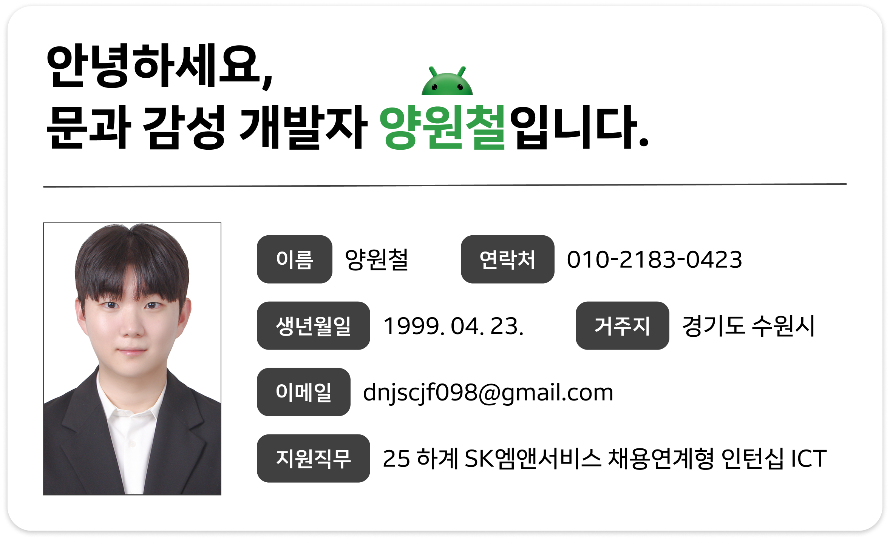

# skmnservice
2025 하계 SK엠앤서비스 채용연계형 인턴십 ICT 직무 코딩테스트(과제전형)

 

## 지원자 정보

 

## 프로젝트
개발 기간: 2025. 07. 01. ~ 2025. 07. 03.

각 프로젝트의 소제목을 클릭하면 상세 페이지로 넘어갑니다.

### [21830423-task-1](https://github.com/Bluesion/skmnservice/blob/main/21830423-task-1/feedback/README.md)

#### <ins>**주요 기능**</ins>
- Map Matching
  - 주어진 GPS 좌표와 도로 정보를 바탕으로 GPS 좌표를 가장 가까운 도로 선의 좌표로 매칭합니다.

- 경로 이탈
  - 차량의 경로와 실제 매칭된 도로가 다른 경우, 해당 좌표를 경로 이탈로 판정합니다.

- <ins>**기술 스택**</ins>

`Kotlin`

- <ins>**개발 환경**</ins>

`Kotlin` 2.2.0

`IntelliJ IDEA` 2025.1.3

 

### [21830423-task-2](https://github.com/Bluesion/skmnservice/blob/main/21830423-task-2/feedback/README.md)

#### <ins>**주요 기능**</ins>
- 인물 검색
  - 데이터에서 이름을 검색하고, 해당 사람의 정보를 보여줍니다.

- CSV parsing
  - 100,000만건의 거대한 csv 파일을 파싱합니다.

- <ins>**기술 스택**</ins>

`JavaScript`

- <ins>**개발 환경**</ins>

`Visual Studio Code` 2025.1.3
